# Passenger Comfort Assessment in Dynamic Driving Environments  

<table>
   <tr align="center">
      <td>
         Labeled Data by Test Subject
      </td>
      <td>
         Personalized Comfort Levels
      </td>
   </tr>
  <tr>
    <td>
      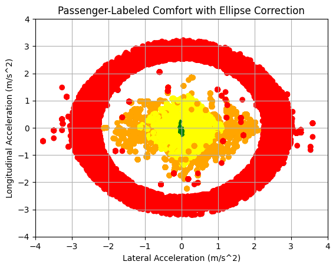
    </td>
    <td colspan="2" align="center">
      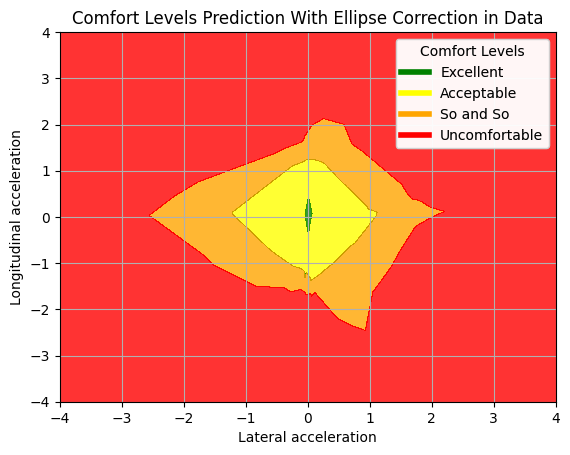
    </td>
  </tr>
</table>

Hi there!  

I’m **Török Ármin**, and I’m thrilled to share this repository with you. It contains the implementation and findings from my **Bachelor Thesis**, which I presented at Babeș-Bolyai University, Cluj-Napoca, in 2024.  

## Inspiration  

This project was inspired by real-life experiences in my hometown, where many cab drivers are known for their aggressive and hectic driving styles. After taking several rides, I noticed a trend: more people were consciously or subconsciously choosing Uber over traditional cabs. The main reason? Uber drivers were generally calmer and more composed behind the wheel.  

This sparked my curiosity about the emotional experience of passengers during driving. How does driving behavior affect passenger comfort? How do these experiences differ when you're the passenger versus when you're the driver? These questions laid the foundation for my research.  

## Goals  

The main objectives of this project were:  
1. **Raising awareness** of how driving behavior impacts passenger comfort.  
2. **Highlighting the contrasting experiences** between passengers and drivers in the same scenario.  
3. **Developing an AI-powered solution** to dynamically predict and assess passenger comfort levels in various driving situations.  

## About This Repository  

This repository contains:  
- **Applications and tools** developed during the project.  
- **Datasets and models** used for training and evaluation.  
- Insights and findings to help understand passenger comfort in diverse driving scenarios.  

I’ve made these resources open-source because I’m passionate about software innovation and believe in the value of sharing knowledge. I hope this repository offers a clear understanding of comfort levels and their impact on driving experiences.  

## Get In Touch  

If you have any questions or face any issues while exploring this project, feel free to reach out! I’d be more than happy to help.  

Thank you for your interest in my work, and I hope this project inspires you as much as it inspired me!  

Warm regards,  
**Török Ármin**  

## Motivation  

My passion for the automotive industry has been lifelong. As a former professional racing driver during my childhood, I’ve been captivated by cars and driving ever since. When I got my driver’s license, I quickly discovered I had a natural talent for driving—something frequently confirmed by feedback from passengers who often describe me as a calm and comfortable driver.  

However, I can’t say the same for everyone I’ve shared a car with. It’s not easy to tell someone they are an aggressive driver, even though their behavior can significantly impact passenger comfort. This inspired me to create an application that raises awareness about how passengers feel during a ride.  

### Addressing Passenger Sensitivity  

The project is especially relevant for individuals who may require extra care during transportation. For instance, people recovering from medical conditions such as hip replacements are often more sensitive to sudden movements or aggressive driving styles. By helping drivers understand how their behavior impacts passengers, the goal is to foster smoother and more considerate driving habits for everyone.  

### Safety Through Awareness  

It’s often said that speeding kills—and aggressive drivers are more likely to speed. Encouraging less aggressive, more comfortable driving could lead to fewer accidents, making the roads safer for everyone.  

### Passion for Autonomous Driving  

As the automotive industry shifts towards autonomous vehicles and prioritizes enhanced user experiences, passenger comfort has become a critical factor. This project leverages vehicle dynamics data and physiological responses to create a reliable system for predicting and visualizing passenger comfort.  

By building velocity profiles tailored to individual passengers, autonomous driving systems could adapt to ensure the ride remains consistently within a passenger’s comfort levels. This innovation contributes to the development of safer, more personalized autonomous driving solutions, helping to make the future of transportation both comfortable and secure.  

## Repository Structure

The repository is organized into the following sections:

### 1. **Gathered_Data**  
This folder contains synchronized datasets collected from vehicle sensors (e.g., CAN Bus, OBD-II) and heart rate monitoring devices.  

- **Content Removed:** Certain files within this folder have been removed to protect the identity of the test subjects involved in this research.  

If you're interested in further developing this project and believe the dataset I created could be useful to you, feel free to reach out. I’d be happy to provide the full dataset upon request, as it hasn’t been fully uploaded to this repository for privacy reasons.  

### 2. **Jupyter_Notebooks**  
This folder contains Python notebooks developed for various stages of the project, including:  
- **Data preprocessing and synchronization**: Cleaning and aligning the datasets collected from sensors and devices.  
- **Statistical calculations**: Analyzing trends and patterns within the data.  
- **Visualization**: Creating insightful plots to better understand passenger comfort metrics.  
- **AI model workflows**: Training, testing, and evaluating machine learning models.  
- **Labeling data**: Leveraging AI models to assign comfort-level labels to the collected data.  

### 3. **Media**  
This folder contains:  
- **Plots**: Visual representations of the analyzed data, generated during various phases of the project.  
- **Photos**: Supporting images captured during the analysis phase.    

Most of these plots and photos were integral to the Bachelor Thesis and can also be found within the accompanying PDF file: [Török_Ármin_Bachelor_Thesis.pdf](Török_Ármin_Bachelor_Thesis.pdf).  
 

### 4. **Python_Applications**  
This folder contains various Python scripts developed and utilized during the thesis, including:  

#### 1. **Comfort Level Visualization Application (built with PyQt)**  
This application visualizes comfort levels on an xOy axis, allowing users to select a Neural Network to predict points on a mesh with a specific step size. It displays each comfort zone in distinct colors relevant to this project as it can be seen in the previous images.

<table>
   <tr align="center">
      <td>
         Baseline Comfort Levels
      </td>
      <td>
            Personalized Comfort Levels <br>
            of a test subject
      </td>
   </tr>
  <tr>
    <td>
      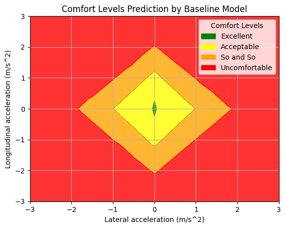
    </td>
    <td colspan="2" align="center">
      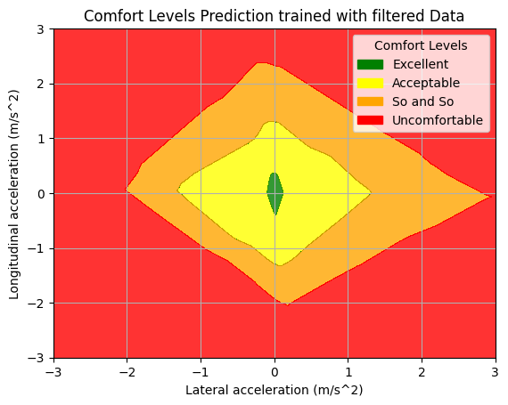
    </td>
  </tr>
</table>

Comfort levels in this project are determined based on the combination of **lateral and longitudinal acceleration** exerted on the human body during driving. The comfort zones reflect the impact of these forces, with the baseline comfort levels represented in the thesis.  

The application enables comparison of comfort zones for different test subjects and evaluates how various models predict comfort levels for specific values. Several use cases and functionalities of the application are demonstrated in the following images:

<table>
   <tr align="center">
      <td colspan="2">
         Comfort Level Visualization Application
      </td>
   </tr>
  <tr>
    <td>
      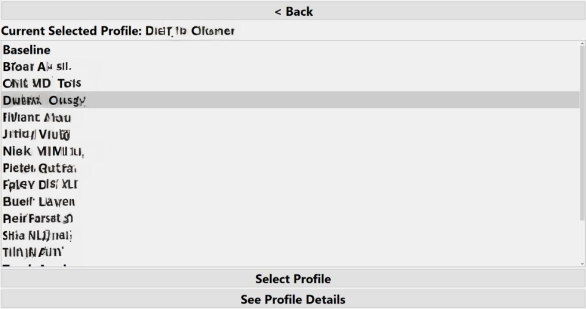
    </td>
    <td>
      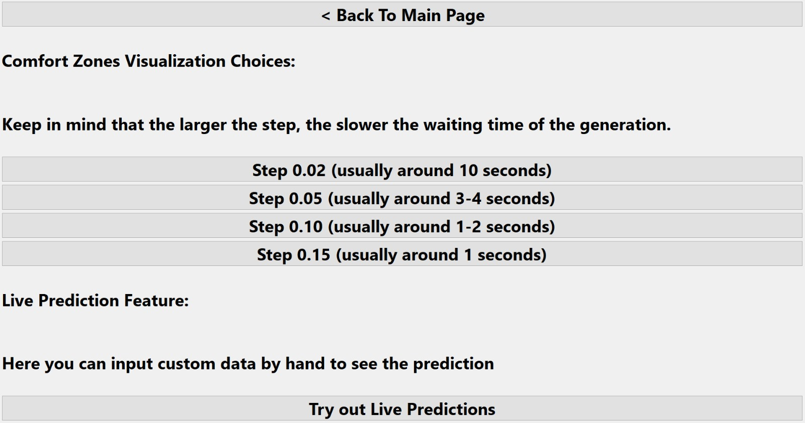
    </td>
  </tr>
  <tr>
    <td>
      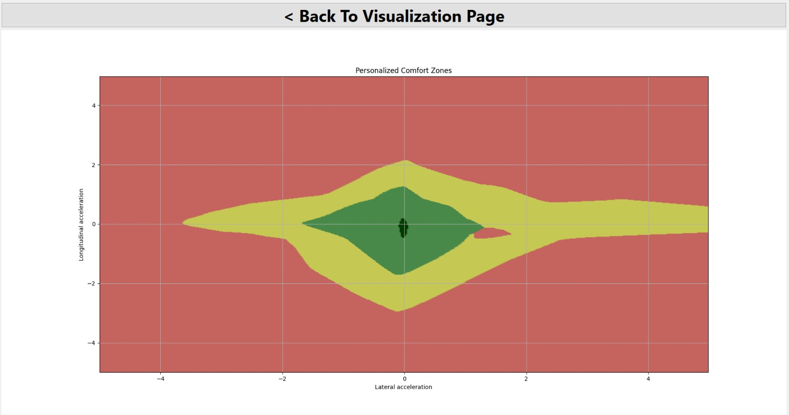
    </td>
    <td>
      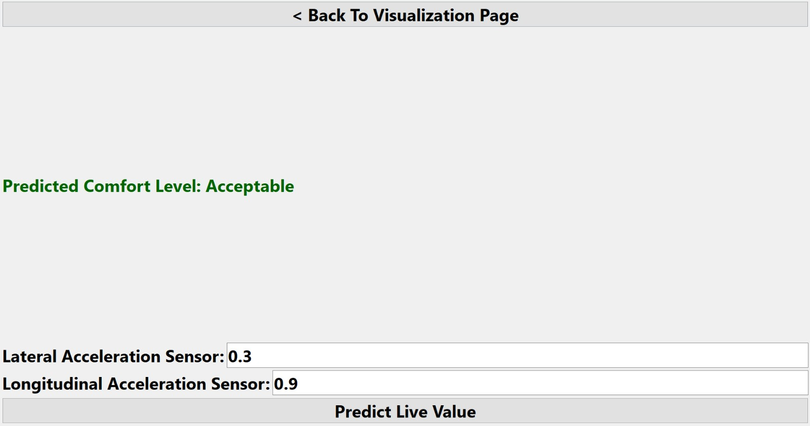
    </td>
  </tr>
  <tr>
    <td colspan="2" align="center">
      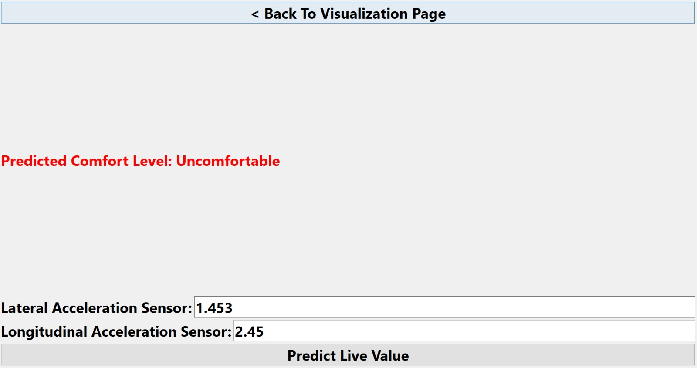
    </td>
  </tr>
</table>

#### 2. **Recorded Data Synchronization Tools**  
This application is designed to synchronize data collected during the testing phase. Given the diversity of data sources (e.g., GPS, heart rate monitors, vehicle sensors), this tool centralizes all information into a single, cohesive file.  

At the start of the synchronization process, the first row in the file is written only after each sensor has provided at least one value. This ensures that the dataset begins with a complete set of initial values from all sensors.  

After the initial row, each new sensor entry is added as a new row in the file. For these subsequent entries, all previous sensor values are carried forward, while the new row reflects the updated value from the recently active sensor. This approach guarantees a complete dataset without any missing values, ensuring that every row contains synchronized data for all sensors.  

This method makes the data well-suited for analysis and model training, providing a consistent and structured format for further processing.  
  

#### 3. **CARLA Simulator Scripts for Testing in Simulated Environments**  
This folder contains scripts adapted from the official CARLA Simulator documentation. These scripts have been modified to display the real-time predictions of the AI model directly on the screen during simulation.  

By running these scripts with a trained Neural Network, the simulation provides acceleration values to the AI model, which predicts comfort levels and displays the results in the control panel (situated at the top-left corner of the screen). Use cases for these scripts are illustrated in the following images: 

<table>
   <tr align="center">
      <td colspan="2">
         CARLA Simulator Examples
      </td>
   </tr>
  <tr>
    <td>
      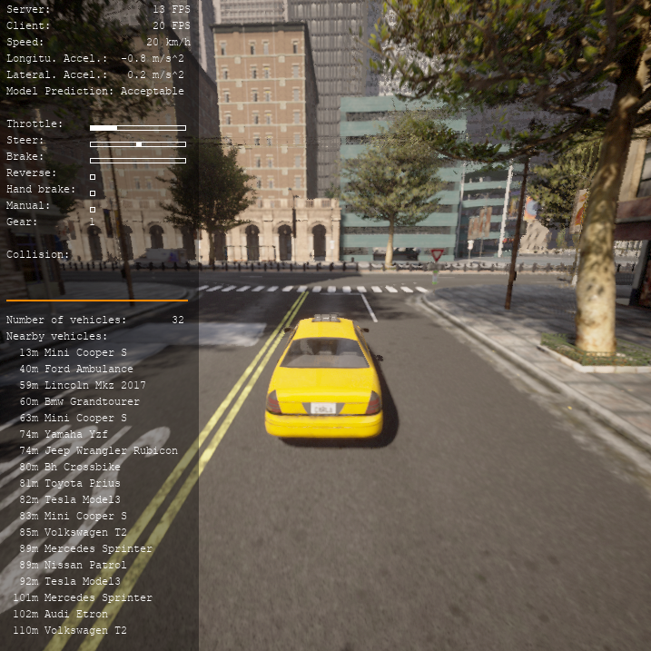
    </td>
    <td>
      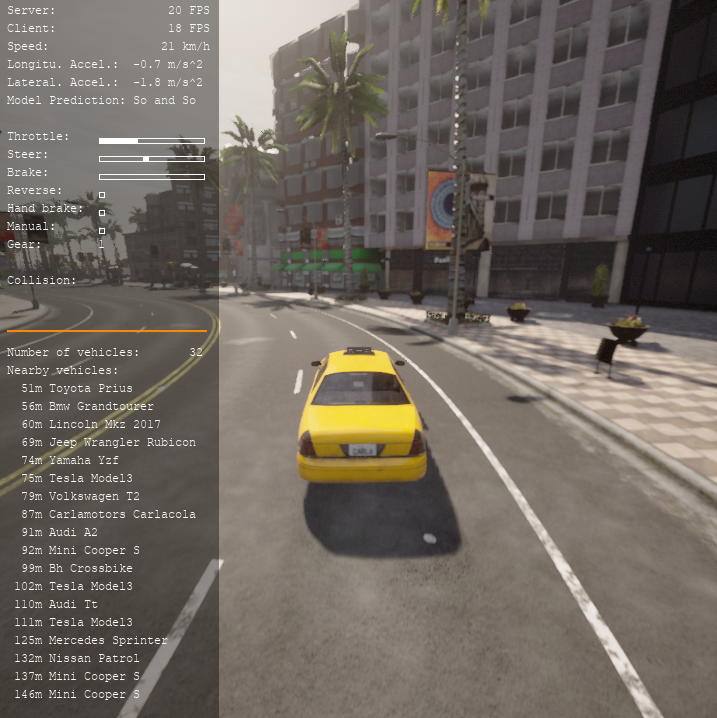
    </td>
  </tr>
  <tr>
    <td>
      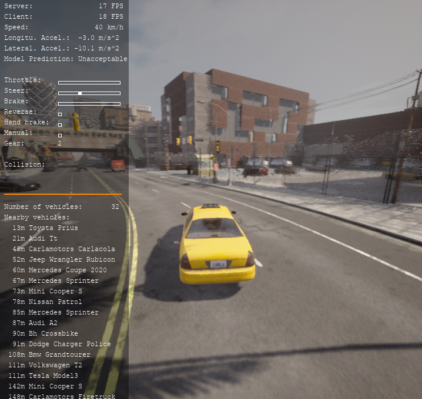
    </td>
    <td>
      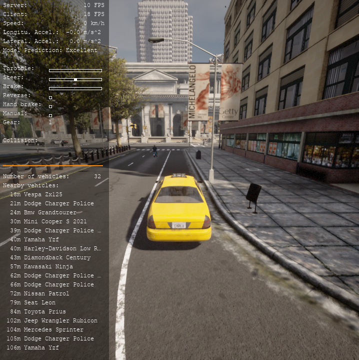
    </td>
  </tr>
</table>

This folder plays a crucial role in testing, analyzing, and demonstrating the project's findings, ensuring the accurate prediction and visualization of comfort levels under both real-world and simulated conditions.  


### 5. **Trained_Neural_Networks**
   - Contains the trained AI models, including the model trained on the linear/baseline comfort levels and 8  personalized models, each trained on data gathered from individual test subjects.
   - Each model can be imported or loaded in applications and can be used to predict comfort levels based on the input values. As an imput the model accepts lateral and longitudinal accelration values. An example method to predict comfort levels would look like following:
   ``` model.predict(np.array([["Longitudinal Acceleration Value", "Lateral Acceleration Value"]]),verbose=0) ```
   - **Content Removed:** Data specific to test subjects has been excluded for privacy reasons.

## Key Features

- **Data Collection and Synchronization**: Efficient integration of vehicle sensor data and heart rate monitoring, processed to align timestamps.  
- **AI-Driven Comfort Prediction**: Development of neural network models using TensorFlow to predict passenger comfort based on real and simulated driving data.  
- **Visualization Tools**: Interactive applications for real-time comfort analysis and dynamic visualizations.  
- **Simulation Environment**: Use of CARLA simulator and Logitech G29 hardware to test comfort in controlled scenarios.

## Ethical Considerations

To ensure the privacy and confidentiality of individuals involved in this research, sensitive data related to test subjects (names and identifying details) has been removed. This complies with ethical research practices and ensures that no personal information is disclosed.

## Applications

- Autonomous vehicle systems to enhance passenger experience.
- Tailored solutions for ride-sharing platforms to improve comfort.
- Integration with insurance models to assess driving quality.

## Future Scope

- **Expanding the Dataset**: Adding more sensor entries and diversifying the data to enhance the model’s applicability across various scenarios and use cases.
- **Industry Collaboration**: Partnering with the automotive industry to integrate this solution into real-world applications, such as ride-sharing platforms or autonomous vehicle systems.

## How to Contribute

Contributions are always welcome! If you'd like to enhance this project or adapt it for new applications, feel free to fork the repository and submit a pull request.

I do have one small request: let me know if I can assist you! I’d love to learn how my work is being used and help clarify any part of the project. Don’t hesitate to reach out for explanations or guidance—I’m here to help!

---

### License

This project is licensed under the GNU Affero General Public License v3.0 - see the [LICENSE](LICENSE) file for details.

---

**Note:** The full methodology and findings can be found in the thesis documents provided in this repository.
